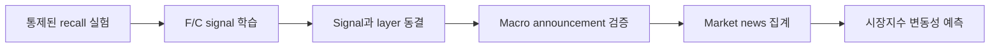

# LLM Knowledge Retrieval Signal을 이용한 시장 변동성 예측

## 1. 연구 아이디어

LLM은 대규모 학습 데이터에 포함된 지식을 parameter 내부에 저장하고, 입력된
text와 관련된 지식을 activation을 통해 회상한다.

이때 다음과 같은 정보는 일반적인 정보와 다른 내부 pattern을 만들 가능성이 있다.

- 모델이 잘 알고 있는 기존 지식과 일치하는 정보
- 모델이 충분히 알지 못하는 새로운 정보
- 모델이 알고 있던 내용과 충돌하거나 기존 상태를 수정하는 정보

금융시장에서도 기존 기대와 크게 다른 정보는 불확실성과 의견 차이를 증가시켜
변동성을 높일 수 있다. 따라서 LLM의 knowledge retrieval 과정에서 나타나는
activation signal을 금융시장의 information surprise proxy로 활용할 수 있는지
검증한다.

> **핵심 가설:** 금융 text가 LLM의 기존 지식과 충돌하거나 큰 지식 갱신을
> 유발할수록 특정 activation pattern이 강하게 나타나며, 이 신호는 이후
> 시장지수 변동성을 예측하는 데 추가 정보를 제공한다.

---

## 2. 측정할 내부 신호

하나의 포괄적인 novelty score를 바로 만들기보다 두 신호를 구분한다.

### Familiarity / Retrieval Strength (`F`)

모델이 입력과 관련된 기존 지식을 얼마나 안정적으로 회상하는지를 나타낸다.
높은 `F`는 해당 정보가 참이라는 뜻이 아니라, 모델 내부에 강한 association이
존재한다는 뜻이다.

### Knowledge Conflict / Revision (`C`)

새로운 text가 모델이 회상한 기존 지식 또는 익숙한 사건 구조와 얼마나
충돌하는지를 나타낸다. 금융 응용에서는 `C`를 주된 예측 신호로 사용하고 `F`는
보조 신호로 사용한다.

`F`와 `C`를 정의하거나 layer를 선택할 때 수익률, 변동성 또는 거래량을
사용하지 않는다.

---

## 3. 연구 질문

1. 모델이 알고 있는 사실과 모르는 사실을 activation으로 구분할 수 있는가?
2. 기존 지식과 일치하는 문맥과 충돌하는 문맥을 activation으로 구분할 수 있는가?
3. 이렇게 만든 frozen signal이 실제 macro surprise와 연결되는가?
4. 이 신호가 기존 시장정보와 일반적인 text feature를 넘어 시장지수 변동성을
   예측하는가?

---

## 4. 전체 실험



---

## 5. 1단계 — Knowledge Retrieval Signal 만들기

### 데이터 구성

같은 entity와 relation에 대해 문장 구조를 최대한 맞춘 contrast를 만든다.

| 구분 | 내용 |
|---|---|
| Known–Consistent | 모델이 알고 있는 사실과 일치하는 문맥 |
| Known–Conflict | 모델이 알고 있는 사실과 충돌하는 문맥 |
| Known–Update | 기존 사실이 시간에 따라 바뀌었다는 문맥 |
| Unknown–New | 모델이 사전에 알지 못하는 새로운 사실 |

모델이 어떤 사실을 알고 있다고 임의로 가정하지 않는다. 문맥 없이 여러
paraphrase로 질문했을 때 정확하고 일관되게 답하는 사실만 `Known`으로 사용한다.

### Activation 추출

- Activation에 접근할 수 있는 open-weight LLM을 사용한다.
- 모델의 학습 cutoff가 명확해야 한다.
- 모든 입력 뒤에 동일한 retrieval 질문을 붙인다.
- 생성 답변이 아니라 고정된 answer-cue 위치의 layer별 activation을 추출한다.

### Signal 학습

각 layer에서 간단한 linear probe를 학습한다.

```text
F = known fact와 unknown fact를 구분하는 activation direction
C = consistent context와 conflict/update context를 구분하는 activation direction
```

Entity와 prompt template을 기준으로 train/validation/test를 분리한다. Validation의
recall 성능으로 layer를 선택한 뒤 `F`, `C`, prompt와 layer를 모두 동결한다.

### 필수 통제

- 문장 길이
- 희귀 단어와 고유명사
- Token NLL 또는 perplexity
- 일반 embedding distance
- 의미를 유지한 paraphrase

이 통제 이후에도 새로운 entity와 template에서 성능이 유지되어야 retrieval
signal로 인정한다.

---

## 6. 2단계 — Scheduled Macro Announcement 검증

먼저 공개 시각과 외부 surprise 기준이 명확한 macro announcement에 적용한다.

대상 후보:

- CPI와 PCE
- 고용보고서
- GDP와 소매판매
- ISM
- FOMC 결정과 statement

각 발표에서 최초 공개 문서만 사용하고 다음 값을 연결한다.

```text
외부 surprise = |최초 발표값 - 발표 직전 시장 consensus|
```

Frozen `F/C`가 외부 surprise와 연결되는지 먼저 확인한다. 이후 발표 후 30분,
60분 및 다음 거래일의 미국 주가지수 또는 지수선물 realized volatility를
예측한다.

주요 통제 변수:

- 발표 전 realized volatility
- VIX 또는 implied volatility
- Consensus surprise
- Sentiment
- Token NLL
- Embedding novelty

동일 시각에 여러 지표가 발표되면 하나의 event cluster로 처리한다.

---

## 7. 3단계 — Market/Macro News와 지수 변동성

Macro pilot이 성공하면 일반적인 market news로 확장한다.

### 뉴스 처리

1. 정확한 최초 공개 timestamp를 사용한다.
2. 같은 사건을 다룬 중복 기사와 후속 update를 하나의 event로 묶는다.
3. 최초 공개 text에 frozen `F/C`를 적용한다.
4. 시장과 직접 관련된 event만 독립적인 relevance filter로 선별한다.

### 시간 단위 집계

중요한 사건이 평균에서 희석되지 않도록 단순 평균보다 다음 집계를 우선한다.

- 시간 구간 내 `max C`
- `top-k mean C`
- 높은 `C`를 가진 event 비율
- Event 수와 보도량

### 예측 대상

- S&P 500 또는 지수선물의 미래 1일 realized volatility
- 미래 5일 realized volatility
- Nasdaq-100과 주요 sector index는 확장 결과로 사용

HAR 계열, VIX, 과거 변동성, news volume, sentiment, embedding novelty를 포함한
baseline에 frozen `F/C`를 추가한다. 모든 모델은 시간 순서대로 학습하고 마지막
기간을 한 번만 out-of-sample 평가한다.

Primary metric은 QLIKE로 하고 Log-MSE, out-of-sample `R²`와 Spearman을 함께
보고한다. 통계적 유의성은 날짜 단위 block bootstrap으로 평가한다.

---

## 8. 필수 연구 원칙

- 모델 cutoff 이후의 금융 text만 primary 평가에 사용한다.
- `F/C`를 만드는 과정에는 어떠한 시장 outcome도 사용하지 않는다.
- Layer, prompt와 집계 방식은 test 결과를 보기 전에 고정한다.
- 기사 공개 시각 이후의 가격이나 수정된 본문을 입력에 포함하지 않는다.
- 기사 수가 아니라 독립적인 날짜와 event cluster를 표본 수로 본다.
- LLM surprise를 시장의 객관적인 정보량이라고 해석하지 않는다.

---

## 9. 성공 조건

연구의 핵심 주장을 지지하려면 다음 세 조건이 순서대로 충족되어야 한다.

1. `F/C`가 새로운 entity와 template에서도 recall/conflict를 안정적으로
   구분한다.
2. Frozen `C`가 macro consensus surprise와 예상 방향으로 연결된다.
3. Frozen `F/C`가 강한 market/text baseline보다 시장지수 volatility의
   out-of-sample QLIKE를 유의하게 개선한다.

1번이 실패하면 knowledge retrieval signal이라는 해석을 중단한다. 1번은
성공하지만 2번 또는 3번이 실패하면, LLM 내부 신호는 존재하지만 금융시장의
surprise 또는 변동성 예측에는 적합하지 않은 것으로 결론낸다.

---

## 10. 가장 먼저 할 Pilot

1. Cutoff가 명확한 open-weight LLM 하나를 선택한다.
2. 작은 factual contrast set으로 `F/C`를 학습한다.
3. 새로운 entity와 template에서 signal을 검증하고 동결한다.
4. CPI, 고용보고서와 FOMC 문서에 frozen signal을 적용한다.
5. Consensus surprise 및 발표 후 30분 지수선물 volatility와의 관계를 확인한다.

이 pilot의 목적은 forecasting 성능을 최대화하는 것이 아니라 다음 두 질문에
답하는 것이다.

> 의도한 knowledge retrieval/conflict signal을 실제로 측정하고 있는가?

> 시장 label을 사용하지 않은 이 신호가 실제 금융 surprise와 연결되는가?
