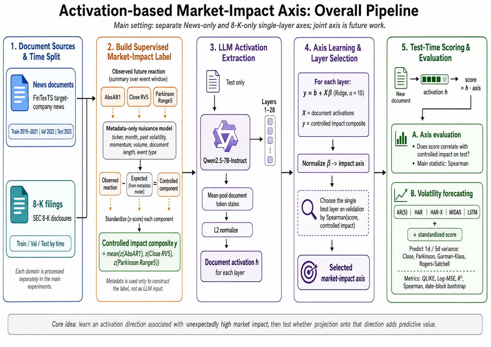
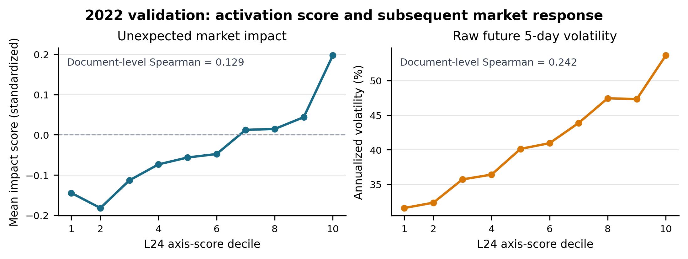
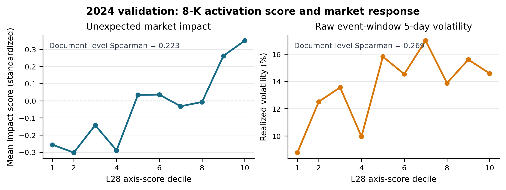
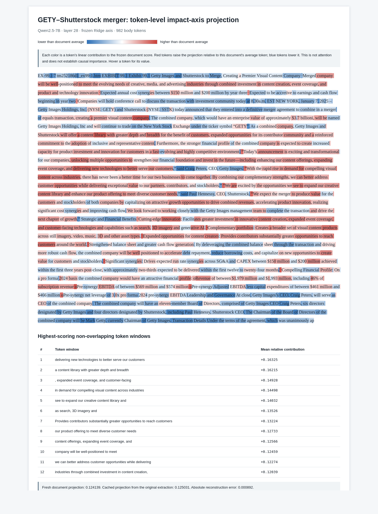
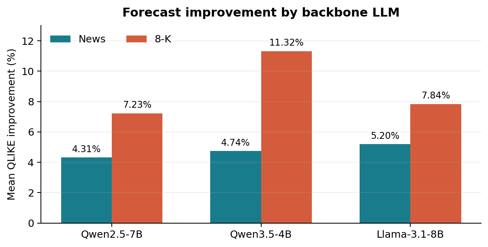
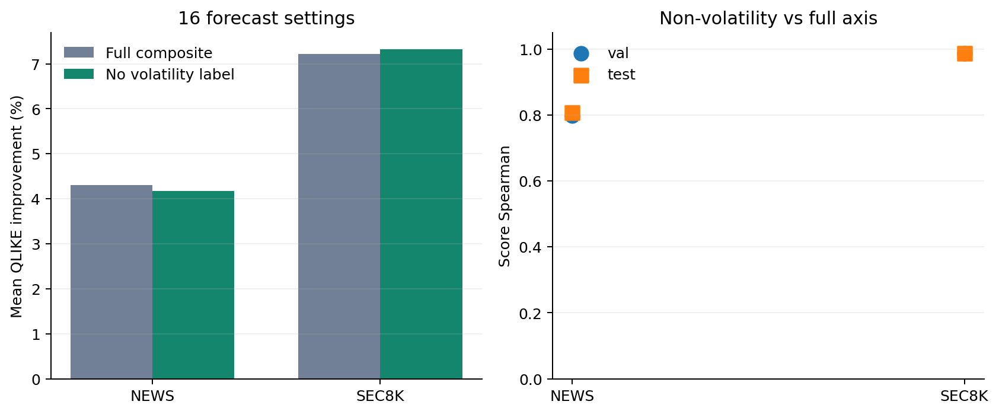

# News-only / 8-K-only Impact Axis 실험

## 0. 문제의식

시장에는 매일 수많은 뉴스와 공시가 나온다. 투자자와 분석가는 이 문서를 모두 자세히 읽기 어렵기 때문에, **어떤 문서가 실제로 중요한 정보를 담고 있는지 빠르게 구분하고 싶어 한다.**

하지만 문서의 중요도는 단순히 길거나 특정 단어가 포함됐다는 사실만으로 결정되지 않는다. 같은 내용도 어떤 기업과 상황에서 발생했는지에 따라 평범한 반복 정보일 수도 있고, 시장의 기대를 바꾸는 새로운 정보일 수도 있다.

LLM은 문서를 읽는 과정에서 그 의미와 맥락을 내부 activation에 표현한다. 그렇다면 모델이 중요하다고 처리하는 문서와 그렇지 않은 문서는 **최종 답변을 생성하기 전부터 activation level에서 서로 다르게 나타날 수 있지 않을까?**

따라서 이 실험의 핵심 질문은 다음과 같다.

> 중요한 금융 문서를 나타내는 방향이 LLM activation에 존재하는가? 그 방향에 문서를 projection한 score로 실제 시장에서 중요한 뉴스와 공시를 구분할 수 있는가?

이를 확인하기 위해 실제 시장반응이 컸던 문서를 `important text`의 관찰 가능한 proxy로 사용한다. News와 8-K에서 각각 activation axis를 학습하고, axis projection score가 새로운 기간의 시장반응 및 미래 변동성과 연결되는지 검증한다. 여기서 학습하는 axis는 순수한 무감독 `familiar/unfamiliar axis`라기보다, 실제 시장반응으로 감독된 **market-impact axis**다.

## 1. 이 문서의 범위

### 1.1 한눈에 보는 전체 실험



*Figure 1. News와 8-K를 시간 순서로 분리하고, 예상 가능한 기업·시장 반응을 제거한 impact label 생성, LLM activation 추출, validation 기반 axis 선택, test 시점의 impact association 및 volatility forecasting까지 이어지는 전체 파이프라인. Main 결과는 domain별 single-layer axis이며 Joint axis는 별도 확장 실험이다.*

현재 main 결과는 News-only와 8-K-only에서 **각각 validation으로 고정한 single-layer axis 하나**를 사용한다. 여러 layer score를 다시 결합한 all-layer stack은 별도의 탐색 실험이며 위 main pipeline과 baseline 비교에는 포함하지 않는다.

### 1.2 실험 범위

전체 연구는 학습 데이터 구성에 따라 다음 세 가지 설정으로 나눈다.

| 설정 | Axis 학습 데이터 | 평가 목적 |
|---|---|---|
| **News-only** | 뉴스만 사용 | 뉴스에서 중요한 text를 구분할 수 있는지 확인 |
| **8-K-only** | 8-K만 사용 | 공시에서 중요한 text를 구분할 수 있는지 확인 |
| **Joint (진행중)** | 뉴스와 8-K를 함께 사용 | 문서 유형을 넘어 전이되는 공통 importance axis가 있는지 확인 |

먼저 News-only와 8-K-only를 통해 각 문서 유형에서 activation-level importance signal이 독립적으로 존재하는지 확인한다. 이후 Joint에서는 두 데이터를 domain-balanced 방식으로 합쳐 공통 axis 하나를 학습하고, 그 axis가 뉴스와 8-K 양쪽에 일반화되는지 평가한다.

이 문서는 Qwen2.5-7B에서 각각 따로 학습한 다음 두 단독 실험을 우선 정리한다.

1. FinTexTS news-only impact axis
2. SEC 8-K-only impact axis

현재 main specification을 단계별로 요약하면 다음과 같다.

| 단계 | 고정된 설정 | 의미 |
|---|---|---|
| **Supervision** | `AbsAR1`은 첫 반응일의 시장조정 절대수익률, `Close RV5`는 향후 5일 종가수익률 제곱의 평균, `Parkinson Range5`는 향후 5일 고가·저가 range variance의 평균이며, 각 값에서 사전 기업·시장 정보로 예상되는 부분을 뺀 뒤 표준화해 동일가중 평균 | 모든 train 문서에 하나의 연속형 impact 값을 부여해 Ridge의 예측 target으로 사용 |
| **Axis 학습** | 각 layer에서 `X = 문서별 mean-pooled activation`, `y = 연속형 impact composite`로 두고 Train Ridge `y ≈ b + Xβ` (`alpha=10`)를 적합 | Impact를 가장 잘 예측하는 coefficient vector `β`를 단위벡터로 정규화해 axis로 사용하며, 새 문서의 `score = activation · axis`가 높을수록 high-impact 방향에 가깝다고 해석 |
| **Layer 선택** | Validation에서 score와 controlled composite의 Spearman이 가장 높은 **single layer** | Test 결과를 보기 전에 사용할 layer 하나를 고정 |
| **Forecast 비교** | 같은 AR(5)·HAR·HAR-X·MIDAS·LSTM을 `score 없음`과 `standardized score 1개 추가`로 각각 재학습 | 기존 가격 정보에 activation score가 추가 정보를 주는지 측정 |
| **Forecast target** | Close·Parkinson·Garman-Klass·Rogers-Satchell × 1일·5일 | 미래 1일 및 5일 variance 예측 |
| **평가** | QLIKE, Log-MSE, R2, Spearman, date-block bootstrap | 예측 오차·설명력·순위와 통계적 안정성을 함께 평가 |

<details>
<summary><strong>Supervision: 예상 가능한 시장반응을 빼는 계산 예시</strong></summary>

아래 숫자는 계산 과정을 보여주기 위한 설명용 예시다. 먼저 train 기간에서 activation을 사용하지 않고 ticker, 월, 문서 공개 전 volatility·momentum·volume과 문서 길이 같은 사전 정보만으로 각 시장반응을 예상하는 nuisance model을 학습한다.

```text
Train에서 component마다 별도의 Ridge를 fitting:

실제 AbsAR1 또는 RV5 또는 Range5
    ≈ f(ticker, 월, 과거 volatility, momentum, volume, 문서 길이)
```

예를 들어 train 데이터로 학습한 RV5 모형에 `AAPL, 과거 RV=0.40, 시장 RV=0.30, momentum=0.10`을 넣었더니 예상 RV5가 `0.50`으로 나왔다고 하자. 해당 문서 이후 실제 RV5가 `0.80`이었다면, 사전에 예상되지 않은 추가 반응은 `0.80 - 0.50 = 0.30`이다. AbsAR1과 Parkinson Range5도 같은 방식으로 별도 모형을 fitting해 예상값을 뺀다.

어떤 Apple 문서에 대해 실제로 관찰한 반응과 nuisance model의 예상값이 다음과 같다고 하자. 표의 값은 각 component에 필요한 변환을 적용한 뒤의 예시 값이다.

| Component | 문서 이후 실제 반응 | 사전 정보로 예상한 반응 | Controlled residual |
|---|---:|---:|---:|
| AbsAR1 | 1.50 | 0.90 | `1.50 - 0.90 = 0.60` |
| Close RV5 | 0.80 | 0.50 | `0.80 - 0.50 = 0.30` |
| Parkinson Range5 | 0.70 | 0.40 | `0.70 - 0.40 = 0.30` |

```text
controlled component
    = 문서 이후 실제 반응
    - 문서가 나오기 전 정보만으로 예상한 반응
```

그다음 세 residual의 scale을 맞추기 위해 train 기간의 평균과 표준편차로 각각 z-score를 계산한다. 예를 들어 위 residual이 차례로 `+1.20`, `+0.40`, `+0.50` 표준편차에 해당한다면 최종 label은 다음과 같다.

```text
impact composite
    = mean(1.20, 0.40, 0.50)
    = 0.70
```

따라서 이 문서는 기업의 평소 특성과 직전 시장 상태를 고려해도 예상보다 큰 반응을 만든 문서로 표시된다. Nuisance model과 표준화 통계는 train에서만 학습하고, validation과 test에는 고정된 값을 그대로 적용한다.

</details>

**핵심:** 모든 train 문서에 연속형 impact 값 `y`를 하나씩 부여하고, 각 layer의 activation을 `X`로 사용해 Ridge `y ≈ b + Xβ`를 학습한다. Impact를 가장 잘 예측하는 coefficient `β`를 정규화한 방향이 axis이며, 새 문서의 activation을 이 axis에 projection한 값이 최종 impact score다.

이때 news와 8-K는 정보 공개 시각의 정밀도가 다르기 때문에 첫 시장반응일만 다르게 정한다.

| Domain | 문서 시점 | 첫 시장반응 |
|---|---|---|
| News | FinTexTS 날짜 `t`, 정확한 시각 없음 | 다음 거래일 `t+1` |
| 8-K | SEC acceptance timestamp | 09:30 ET 이전이면 당일, 이후이면 다음 거래일 |

---

## 2. 공통 market-impact label

### 2.1 전체 아이디어

이 연구는 중요한, 즉 **시장에 impact가 있는 text**와 중요하지 않은 text가 LLM 내부에서 서로 다른 activation pattern을 만들고, 그 차이를 나타내는 방향이 존재한다고 가정한다.

```text
중요한 text activation       -> axis의 positive 방향
중요하지 않은 text activation -> axis의 negative 방향
```

이러한 axis를 찾으려면 어떤 문서가 실제로 중요한지 구분하는 기준이 필요하다. 하지만 금융 문서에는 객관적인 `importance` 정답 label이 직접 주어져 있지 않다. 따라서 문서가 공개된 뒤 실제 시장이 얼마나 크게 반응했는지를 중요도의 관찰 가능한 proxy로 사용한다.

```text
문서 공개 후 시장반응이 큼
    -> 높은 impact score
    -> 중요한 text의 proxy

문서 공개 후 시장반응이 작음
    -> 낮은 impact score
    -> 중요하지 않은 text의 proxy
```

구체적으로 각 문서에 미래 절대수익률·5일 종가 변동성·고저가 range로 만든 연속형 impact score를 연결하고, Train activation으로 이 score를 예측하는 Continuous Ridge를 학습한다. Ridge coefficient가 가리키는 **impact score가 높아지는 activation 방향**을 axis로 사용하며, 여기서 중요한 문서는 공개 이후 실제 시장반응이 컸던 text를 의미한다. *(Ticker마다 원래 변동성이 다르고 특정 날짜에는 시장 전체가 함께 크게 움직일 수 있는데, 이러한 사전에 예상 가능한 요인을 제거하지 않은 raw impact를 사용했을 때는 기업·시장 효과가 axis에 섞여 문서 고유 impact를 측정하는 결과가 좋지 않았다.)*

### 2.2 Impact score의 세 구성요소

<details>
<summary><strong>AbsAR1, Close RV5, Parkinson Range5 정의 보기</strong></summary>

| Component | 간단한 계산 | 측정하는 것 |
|---|---|---|
| **AbsAR1** | `log(abs(첫 반응일 기업 수익률 - 같은 날 시장 수익률) + ε)` | 주가 방향과 관계없이 첫날 시장 대비 얼마나 크게 움직였는가 |
| **Close RV5** | `첫 반응일부터 5일간 close-to-close return²의 평균` | 문서 공개 후 5일 동안 종가 기준 변동성이 얼마나 컸는가 |
| **Parkinson Range5** | `첫 반응일부터 5일간 log(High/Low)² / (4 log 2)의 평균` | 종가뿐 아니라 장중 고가·저가 범위까지 포함한 변동성이 얼마나 컸는가 |

</details>

### 2.3 예상 가능한 반응 제거

우리가 찾고 싶은 것은 단순히 **주가가 많이 움직인 문서**가 아니다. 해당 기업의 평소 특성과 당시 시장 상황을 고려해도 설명되지 않는, 문서 고유의 예상 밖 시장반응에 더 가깝다.

<details>
<summary><strong>간단한 계산 예시 보기</strong></summary>

아래 수치는 residual 계산을 설명하기 위한 간단한 예시다.

```text
평소에도 변동성이 큰 기업 A
실제 문서 이후 RV5          = 8
과거 상태로 예상한 RV5      = 7
Controlled RV5 residual    = 8 - 7 = 1

평소에는 안정적인 기업 B
실제 문서 이후 RV5          = 5
과거 상태로 예상한 RV5      = 2
Controlled RV5 residual    = 5 - 2 = 3
```

Raw RV5만 보면 `8 > 5`이므로 기업 A의 문서가 더 중요해 보인다. 하지만 각 기업의 기존 상태와 비교하면 기업 B는 예상보다 3만큼 더 움직였고, 기업 A는 예상보다 1만큼 더 움직였다.

따라서 controlled impact 기준에서는 기업 B의 문서를 더 큰 정보 충격으로 평가한다.

</details>

이 연구에서는 이처럼 **기존 정보로 설명되지 않는 추가 반응**을 문서의 진짜 impact에 더 가까운 값으로 본다.

이를 위해 각 domain의 train 기간에서 먼저 시장반응의 예상치를 학습하는 nuisance Ridge model을 만든다. 이 모형은 문서 activation을 사용하지 않고, 문서가 나오기 전부터 알 수 있던 기업 및 시장 metadata만 사용한다.

| 제거하려는 효과 | 사용 정보의 예 |
|---|---|
| 어떤 기업은 원래 변동성이 큼 | Ticker |
| 특정 월이나 시장 국면에 전체 변동성이 큼 | 월, 당시 시장 변동성 |
| 뉴스 전부터 이미 주가가 불안정했음 | 과거 수익률·RV·high-low range |
| 이미 상승·하락 추세가 있었음 | Momentum, absolute/negative return |
| 거래가 평소보다 활발하거나 조용했음 | 과거 volume |
| 긴 문서나 특정 사건 종류가 원래 큰 반응을 동반함 | 문서 길이, event category 또는 8-K item |

이 nuisance model은 **train에서만 학습**한다. 이후 validation과 test에도 train에서 고정한 모형을 그대로 적용해, 각 문서의 실제 반응에서 사전에 예상 가능한 부분을 뺀다.

```text
controlled component
    = 실제 미래 시장반응
    - train metadata만으로 예상한 시장반응
```

이렇게 남은 residual은 가능한 한 ticker나 기존 시장 상태가 아니라, 새로 공개된 text와 연결된 반응에 가깝게 만든 값이다. 완전히 순수한 인과효과라고 할 수는 없지만, raw 시장반응보다 문서 고유의 impact를 측정하는 데 더 적합하다.

AbsAR1, RV5, Range5는 원래 scale이 서로 다르므로 train residual의 평균과 표준편차를 이용해 각각 표준화한 뒤 동일가중 평균한다.

```text
controlled impact composite
    = mean(
        standardized controlled AbsAR1,
        standardized controlled RV5,
        standardized controlled Range5
      )
```

News nuisance model에는 ticker, 월, 과거 수익률·range 변동성, 현재 absolute/negative return, momentum, 시장 변동성, 뉴스 길이와 뉴스 event category를 사용했다.

8-K nuisance model에는 ticker, 월, 과거 RV/range/momentum/volume, 문서 길이와 8-K item indicator를 사용했다.

중요하게도 이 metadata의 역할은 axis에 정보를 추가하는 것이 아니라, **impact label에서 기존에 예상 가능했던 반응을 제거하는 것**이다. LLM에는 여전히 뉴스나 8-K 본문만 입력한다. 또한 아래 forecasting의 HAR/HAR-X baseline에는 뉴스 event category나 8-K item type을 넣지 않았다.

---

## 3. News-only 실험

### 3.1 데이터

- 데이터: `EXAONE-BI/FinTexTS`의 target-company 뉴스 요약
- 기업: 100개
- 단위: ticker-date별 뉴스 문서 하나
- Train: 2019~2021, 25,806건
- Validation: 2022, 12,051건
- Test: 2023, 12,478건

### 3.2 Activation 추출

- Model: Qwen2.5-7B-Instruct
- 입력: 고정된 financial-news prefix와 뉴스 본문
- Ticker/date header: 사용하지 않음
- 최대 입력: 512 tokens
- Layer: 1~28 전체
- Pooling: 뉴스 본문 token hidden state의 평균
- 각 activation을 L2 normalize

### 3.3 Axis 학습과 validation 선택

Train의 각 뉴스에는 다음 두 값이 한 쌍으로 연결되어 있다.

```text
뉴스 i의 activation h_i
    = LLM이 뉴스 i를 읽은 뒤 특정 layer에서 만든 3,584차원 vector

뉴스 i의 impact label y_i
    = 뉴스 i가 공개된 뒤 나타난 controlled impact composite
      (기업의 평소 특성과 당시 시장 상황으로 예상되는 impact를 제외하고
       남은, 문서 고유에 가까운 시장반응 효과)
```

예를 들어 뉴스 A의 activation에는 3,584개의 내부 값이 있고, 그 뉴스의 controlled impact score가 `+1.2`라면 다음과 같은 하나의 학습 표본이 된다.

```text
activation h_A = [0.03, -0.12, 0.08, ..., 0.04]
impact y_A     = +1.2
```

Ridge regression은 모든 train 뉴스를 보면서 **어떤 activation 성분들의 조합이 커질 때 실제 impact도 함께 커지는지** 학습한다.

```text
y_i = intercept + beta^T h_i + error_i
```

여기서 `beta`는 activation의 3,584개 성분에 각각 부여된 coefficient를 모은 vector다.

```text
beta = [beta_1, beta_2, ..., beta_3584]

beta_j > 0
    -> activation의 j번째 성분이 클수록 높은 impact와 연결

beta_j < 0
    -> activation의 j번째 성분이 클수록 낮은 impact와 연결
```

따라서 `beta` 전체는 activation 공간에서 **impact가 높아지는 방향**을 나타낸다. 이 방향만 사용하고 vector 크기의 영향을 없애기 위해 길이를 1로 정규화한다.

```text
axis = beta / norm(beta)
```

새로운 뉴스의 score는 그 뉴스 activation이 이 axis 방향을 얼마나 향하고 있는지 내적으로 계산한다.

```text
score_i = normalized_activation_i dot axis
```

해석은 간단하다.

```text
높은 projection score
    -> activation이 train에서 관찰된 high-impact 방향과 유사

낮은 projection score
    -> activation이 low-impact 방향에 가까움
```

이 과정을 layer 1부터 28까지 각각 독립적으로 반복한다. 즉 하나의 Ridge가 모든 layer를 동시에 사용하는 것이 아니라, **layer마다 axis 후보 하나씩**을 만든다.

Validation에서 score와 **예상 가능한 기업·시장 효과를 제외한 최종 impact score** 사이의 raw Spearman이 가장 높은 Ridge layer를 선택했다. Ticker 내부 correlation은 선택 기준으로 사용하지 않았다.

| 선택 항목 | 결과 |
|---|---:|
| Method | Continuous Ridge, alpha=10 |
| Layer | 24 |
| 2022 validation rho | 0.1294 |



왼쪽은 validation에서 실제 선택 기준으로 사용한 관계다. 오른쪽은 참고를 위해 같은 score와 **통제하지 않은 실제 미래 5일 변동성**의 관계를 보여준다. 각 점은 axis score를 기준으로 나눈 10개 구간의 평균이며, 그림의 Spearman은 구간 평균이 아니라 validation 문서 12,051개 전체에서 계산했다.

*(참고: 별도 탐색에서 최종 impact score가 아니라 통제하지 않은 실제 변동성과의 상관만으로 best layer를 선택해 보았지만, 그 score를 HAR/HAR-X에 추가했을 때 forecasting 성능은 실질적으로 개선되지 않았다. Raw volatility에는 ticker별 평상시 변동성이나 당시 시장 전체의 변동성처럼 baseline이 이미 예측할 수 있는 요소가 복합적으로 들어 있다. 따라서 전체 변동성과의 상관은 높아도, text가 제공하는 유의미한 추가 예측 신호로 이어지지 않은 것으로 해석한다.)*

### 3.4 Forecasting 설정

2023 뉴스 test 최대 12,478건에서, validation으로 고정한 **L24 axis score 하나가 기존 변동성 모형에 추가 정보를 주는지** 평가했다.

| Baseline | 사용하는 과거 정보 | `+ Ours` 비교군 |
|---|---|---|
| AR(5) | 최근 5일의 일별 log variance | AR(5) + L24 score |
| HAR | Ticker 효과와 과거 1일·5일·22일 volatility | HAR + L24 score |
| HAR-X | HAR + 수익률, 하락 효과, momentum, 시장 volatility | HAR-X + L24 score |
| MIDAS | Validation에서 선택한 최근 30·50·80일 가중 volatility | MIDAS + L24 score |
| LSTM | 최근 7일 volatility sequence와 ticker embedding | LSTM + L24 score |

모든 `+ Ours`에는 표준화된 L24 score 하나만 추가했다. Baseline과 `+ Ours`는 동일한 pre-test 표본에서 **각각 처음부터 다시 학습**했으며, MIDAS와 LSTM 설정은 validation에서 고정했다.

| 평가 항목 | 설정 |
|---|---|
| Volatility 정의 | Close-to-close, Parkinson, Garman-Klass, Rogers-Satchell |
| 예측 horizon | 미래 1일 variance 또는 미래 5일 일별 variance의 평균 하나 |
| 예측값 | Log variance |
| 주 평가지표 | QLIKE: 낮을수록 좋음 |
| 추가 지표 | Log-MSE, Log-R2, Spearman |
| 통계 검정 | Date-block bootstrap |

### 3.5 News-only forecasting 결과

`a -> b`는 `Baseline -> Baseline + Ours`를 뜻한다. 아래 표는 네 가지 volatility 정의를 동일한 방식으로 평가한 최신 결과다.

**1일 forecast**

| Target | Model | N | QLIKE | 개선 | Log-MSE | Log-R2 | Spearman |
|---|---|---:|---:|---:|---:|---:|---:|
| Close | AR(5) | 12,290 | 3.813 -> **3.582** | **6.06%** | 5.917 -> 5.896 | .030 -> .034 | .246 -> .259 |
| Close | HAR | 12,478 | 4.165 -> **3.857** | **7.39%** | 5.867 -> 5.841 | .040 -> .045 | .258 -> .270 |
| Close | HAR-X | 12,478 | 4.271 -> **3.998** | **6.39%** | 5.789 -> 5.767 | .053 -> .057 | .268 -> .278 |
| Close | MIDAS | 10,811 | 3.999 -> **3.712** | **7.18%** | 5.802 -> 5.774 | .036 -> .041 | .255 -> .267 |
| Close | LSTM | 12,210 | 4.324 -> **4.118** | **4.76%** | 5.866 -> 5.828 | .038 -> .044 | .236 -> .250 |
| Parkinson | AR(5) | 12,478 | .370 -> **.353** | **4.75%** | .588 -> .577 | .364 -> .375 | .599 -> .608 |
| Parkinson | HAR | 12,478 | .375 -> **.356** | **5.14%** | .577 -> .566 | .376 -> .388 | .605 -> .614 |
| Parkinson | HAR-X | 12,478 | .367 -> **.349** | **4.89%** | .556 -> .546 | .398 -> .409 | .618 -> .625 |
| Parkinson | MIDAS | 12,478 | .378 -> **.359** | **5.21%** | .586 -> .575 | .366 -> .378 | .597 -> .606 |
| Parkinson | LSTM | 12,478 | .376 -> **.355** | **5.63%** | .585 -> .571 | .367 -> .382 | .596 -> .606 |
| Garman-Klass | AR(5) | 12,478 | .322 -> **.305** | **5.24%** | .516 -> .507 | .388 -> .399 | .620 -> .628 |
| Garman-Klass | HAR | 12,478 | .324 -> **.306** | **5.50%** | .506 -> .496 | .401 -> .413 | .627 -> .635 |
| Garman-Klass | HAR-X | 12,478 | .314 -> **.297** | **5.35%** | .485 -> .475 | .425 -> .437 | .639 -> .647 |
| Garman-Klass | MIDAS | 12,478 | .327 -> **.309** | **5.50%** | .513 -> .503 | .392 -> .404 | .619 -> .628 |
| Garman-Klass | LSTM | 12,478 | .328 -> **.303** | **7.71%** | .512 -> .499 | .393 -> .408 | .617 -> .629 |
| Rogers-Satchell | AR(5) | 12,453 | .397 -> **.377** | **4.85%** | .646 -> .637 | .317 -> .327 | .570 -> .578 |
| Rogers-Satchell | HAR | 12,470 | .397 -> **.377** | **4.99%** | .629 -> .619 | .335 -> .345 | .581 -> .589 |
| Rogers-Satchell | HAR-X | 12,470 | .383 -> **.364** | **4.87%** | .601 -> .591 | .365 -> .375 | .597 -> .605 |
| Rogers-Satchell | MIDAS | 12,300 | .398 -> **.378** | **5.02%** | .634 -> .624 | .332 -> .342 | .579 -> .587 |
| Rogers-Satchell | LSTM | 12,446 | .406 -> **.382** | **5.89%** | .634 -> .623 | .330 -> .341 | .572 -> .580 |

**5일 forecast**

| Target | Model | N | QLIKE | 개선 | Log-MSE | Log-R2 | Spearman |
|---|---|---:|---:|---:|---:|---:|---:|
| Close | AR(5) | 12,290 | .570 -> **.541** | **5.02%** | .995 -> .975 | .198 -> .213 | .496 -> .511 |
| Close | HAR | 12,478 | .597 -> **.564** | **5.67%** | .956 -> .935 | .228 -> .246 | .512 -> .527 |
| Close | HAR-X | 12,478 | .601 -> **.570** | **5.29%** | .893 -> .875 | .279 -> .294 | .533 -> .546 |
| Close | MIDAS | 10,811 | .560 -> **.527** | **5.86%** | .930 -> .910 | .234 -> .250 | .521 -> .536 |
| Close | LSTM | 12,210 | .601 -> **.565** | **5.97%** | .965 -> .942 | .223 -> .241 | .490 -> .507 |
| Parkinson | AR(5) | 12,478 | .153 -> **.148** | **3.25%** | .282 -> .275 | .498 -> .511 | .708 -> .717 |
| Parkinson | HAR | 12,478 | .151 -> **.145** | **3.65%** | .269 -> .262 | .520 -> .534 | .716 -> .726 |
| Parkinson | HAR-X | 12,478 | .145 -> **.140** | **3.48%** | .253 -> .247 | .549 -> .561 | .727 -> .736 |
| Parkinson | MIDAS | 12,478 | .151 -> **.146** | **3.70%** | .271 -> .264 | .517 -> .530 | .713 -> .724 |
| Parkinson | LSTM | 12,478 | .158 -> **.152** | **3.70%** | .280 -> .273 | .501 -> .514 | .696 -> .708 |
| Garman-Klass | AR(5) | 12,478 | .141 -> **.136** | **3.36%** | .255 -> .249 | .515 -> .527 | .720 -> .730 |
| Garman-Klass | HAR | 12,478 | .139 -> **.134** | **3.63%** | .244 -> .237 | .536 -> .549 | .728 -> .738 |
| Garman-Klass | HAR-X | 12,478 | .132 -> **.128** | **3.57%** | .229 -> .222 | .566 -> .578 | .739 -> .748 |
| Garman-Klass | MIDAS | 12,478 | .140 -> **.135** | **3.66%** | .249 -> .242 | .527 -> .541 | .723 -> .734 |
| Garman-Klass | LSTM | 12,478 | .144 -> **.139** | **3.91%** | .253 -> .245 | .519 -> .535 | .710 -> .722 |
| Rogers-Satchell | AR(5) | 12,441 | .163 -> **.158** | **3.02%** | .286 -> .280 | .469 -> .481 | .694 -> .704 |
| Rogers-Satchell | HAR | 12,458 | .158 -> **.153** | **3.18%** | .271 -> .264 | .498 -> .510 | .706 -> .716 |
| Rogers-Satchell | HAR-X | 12,458 | .150 -> **.145** | **3.16%** | .252 -> .245 | .533 -> .545 | .718 -> .727 |
| Rogers-Satchell | MIDAS | 12,288 | .158 -> **.153** | **3.22%** | .274 -> .267 | .492 -> .506 | .705 -> .715 |
| Rogers-Satchell | LSTM | 12,434 | .161 -> **.156** | **3.21%** | .276 -> .272 | .489 -> .496 | .694 -> .701 |

---

## 4. 8-K-only 실험

### 4.1 데이터와 event timing

- 데이터: SEC 8-K와 연결된 주요 8-K/EX-99 disclosure body
- Train: 2022~2023, 700건
- Validation: 2024, 1,010건
- Test: 2025, 707건
- Forecast test: 최대 453 ticker-session event

SEC acceptance timestamp로 첫 반응 거래일을 정했다.

```text
09:30 ET 이전 공개 -> 그 거래일이 첫 반응일
09:30 ET 이후 공개 -> 다음 거래일이 첫 반응일
```

같은 ticker-session에 문서가 여러 개 있으면 forecasting에서는 해당 session의 최대 axis score를 사용했다.

### 4.2 Activation 추출

- Model: Qwen2.5-7B-Instruct
- 입력: 8-K/EX-99 본문만 사용
- Ticker/date/item header: model input에 사용하지 않음
- 최대 context: 2,048 tokens
- 긴 문서: 256-token overlap chunk
- Layer: 1~28 전체
- Pooling 후 L2 normalize

### 4.3 Axis 학습과 validation 선택

News-only와 동일하게 각 layer의 activation으로 최종 impact score를 예측하는 Continuous Ridge를 학습했다. 8-K impact score는 **예상 가능한 기업·시장 효과를 제외한 AbsAR1, abnormal volume, Close RV5**를 표준화해 평균한 값이다.

2024 validation에서 axis score와 최종 impact score 사이의 raw Spearman이 가장 높은 layer를 선택했다.

| 선택 항목 | 결과 |
|---|---:|
| Method | Continuous Ridge, alpha=10 |
| Layer | 28 |
| 2024 validation rho | **0.2229** |



왼쪽은 validation에서 실제 선택 기준으로 사용한 관계이고, 오른쪽은 같은 score와 **통제하지 않은 실제 5일 realized volatility**의 관계다. 각 점은 axis score의 10개 구간별 평균이며, 그림의 Spearman은 validation 문서 1,010개 전체에서 계산했다.

### 4.4 Forecasting 설정

2025 test의 최대 453개 event에서, validation으로 고정한 **L28 axis score 하나가 기존 변동성 모형에 추가 정보를 주는지** 평가했다.

| Baseline | 사용하는 과거 정보 | `+ Ours` 비교군 |
|---|---|---|
| AR(5) | 최근 5일의 일별 log variance | AR(5) + L28 score |
| HAR | Ticker 효과와 과거 1일·5일·22일 volatility | HAR + L28 score |
| HAR-X | HAR + 수익률, 하락 효과, momentum, 거래량, 시장 volatility | HAR-X + L28 score |
| MIDAS | Validation에서 선택한 최근 30·50·80일 가중 volatility | MIDAS + L28 score |
| LSTM | 최근 7일 volatility sequence와 ticker embedding | LSTM + L28 score |

모든 `+ Ours`에는 표준화된 L28 score 하나만 추가했다. Baseline과 `+ Ours`는 동일한 pre-test 표본에서 각각 다시 학습했으며, 공시 개수·길이·item type·earnings flag는 baseline에 넣지 않았다.

| 평가 항목 | 설정 |
|---|---|
| Volatility 정의 | Close-to-close, Parkinson, Garman-Klass, Rogers-Satchell |
| 예측 horizon | 미래 1일 variance 또는 미래 5일 일별 variance의 평균 하나 |
| 예측값 | Log variance |
| 주 평가지표 | QLIKE: 낮을수록 좋음 |
| 추가 지표 | Log-MSE, Log-R2, Spearman |
| 통계 검정 | Date-block bootstrap |

### 4.5 8-K-only forecasting 결과

`a -> b`는 `Baseline -> Baseline + Ours`를 뜻한다. 아래 표는 네 가지 volatility 정의를 동일한 방식으로 평가한 최신 결과다.

**1일 forecast**

| Target | Model | N | QLIKE | 개선 | Log-MSE | Log-R2 | Spearman |
|---|---|---:|---:|---:|---:|---:|---:|
| Close | AR(5) | 432 | 8.194 -> **7.339** | **10.43%** | 7.653 -> 7.029 | .040 -> .118 | .367 -> .442 |
| Close | HAR | 453 | 8.835 -> **7.201** | **18.49%** | 7.596 -> 6.940 | .041 -> .124 | .362 -> .440 |
| Close | HAR-X | 453 | 6.804 -> **5.974** | **12.20%** | 7.483 -> 6.948 | .055 -> .123 | .384 -> .452 |
| Close | MIDAS | 342 | 7.293 -> **6.612** | **9.34%** | 7.448 -> 6.984 | .066 -> .124 | .408 -> .455 |
| Close | LSTM | 426 | 4.156 -> **3.784** | **8.95%** | 8.261 -> 7.957 | -.035 -> .003 | -.027 -> .337 |
| Parkinson | AR(5) | 453 | .696 -> **.605** | **13.17%** | 1.309 -> 1.108 | .341 -> .442 | .609 -> .674 |
| Parkinson | HAR | 453 | .739 -> **.616** | **16.70%** | 1.334 -> 1.121 | .328 -> .436 | .603 -> .672 |
| Parkinson | HAR-X | 453 | .630 -> **.567** | **10.02%** | 1.322 -> 1.153 | .334 -> .420 | .628 -> .682 |
| Parkinson | MIDAS | 453 | .713 -> **.611** | **14.33%** | 1.329 -> 1.124 | .331 -> .434 | .607 -> .672 |
| Parkinson | LSTM | 453 | 1.009 -> **.952** | **5.71%** | 1.838 -> 1.712 | .075 -> .138 | .491 -> .544 |
| Garman-Klass | AR(5) | 453 | .618 -> **.513** | **16.90%** | 1.198 -> 1.002 | .333 -> .442 | .611 -> .680 |
| Garman-Klass | HAR | 453 | .642 -> **.517** | **19.45%** | 1.210 -> 1.004 | .326 -> .441 | .610 -> .680 |
| Garman-Klass | HAR-X | 453 | .564 -> **.485** | **13.93%** | 1.209 -> 1.045 | .327 -> .418 | .631 -> .689 |
| Garman-Klass | MIDAS | 453 | .628 -> **.523** | **16.75%** | 1.209 -> 1.012 | .327 -> .436 | .610 -> .679 |
| Garman-Klass | LSTM | 453 | .916 -> **.879** | **3.97%** | 1.657 -> 1.589 | .077 -> .115 | .486 -> .535 |
| Rogers-Satchell | AR(5) | 449 | .719 -> **.610** | **15.12%** | 1.319 -> 1.138 | .284 -> .382 | .573 -> .637 |
| Rogers-Satchell | HAR | 433 | .776 -> **.628** | **18.99%** | 1.339 -> 1.138 | .258 -> .370 | .558 -> .626 |
| Rogers-Satchell | HAR-X | 433 | .723 -> **.608** | **15.93%** | 1.343 -> 1.181 | .256 -> .346 | .580 -> .637 |
| Rogers-Satchell | MIDAS | 428 | .782 -> **.653** | **16.46%** | 1.343 -> 1.155 | .253 -> .358 | .556 -> .622 |
| Rogers-Satchell | LSTM | 448 | 1.006 -> **.965** | **4.03%** | 1.722 -> 1.658 | .066 -> .101 | .450 -> .487 |

**5일 forecast**

| Target | Model | N | QLIKE | 개선 | Log-MSE | Log-R2 | Spearman |
|---|---|---:|---:|---:|---:|---:|---:|
| Close | AR(5) | 432 | 1.206 -> **1.162** | **3.62%** | 1.783 -> 1.670 | .267 -> .313 | .546 -> .583 |
| Close | HAR | 453 | 1.237 -> **1.145** | **7.47%** | 1.813 -> 1.690 | .257 -> .307 | .541 -> .580 |
| Close | HAR-X | 453 | 1.102 -> **1.055** | **4.21%** | 1.785 -> 1.691 | .268 -> .307 | .550 -> .582 |
| Close | MIDAS | 307 | 1.268 -> 1.357 | -7.01% | 1.711 -> 1.676 | .272 -> .287 | .548 -> .565 |
| Close | LSTM | 426 | 1.355 -> **1.260** | **6.96%** | 2.523 -> 2.383 | -.034 -> .024 | .157 -> .420 |
| Parkinson | AR(5) | 453 | .293 -> **.271** | **7.58%** | .562 -> .506 | .560 -> .604 | .767 -> .797 |
| Parkinson | HAR | 453 | .301 -> **.272** | **9.59%** | .575 -> .516 | .549 -> .596 | .763 -> .793 |
| Parkinson | HAR-X | 453 | .283 -> **.264** | **6.86%** | .573 -> .519 | .551 -> .593 | .772 -> .798 |
| Parkinson | MIDAS | 453 | .308 -> **.284** | **8.06%** | .583 -> .524 | .543 -> .589 | .761 -> .791 |
| Parkinson | LSTM | 453 | .643 -> **.615** | **4.27%** | 1.103 -> 1.058 | .135 -> .171 | .665 -> .682 |
| Garman-Klass | AR(5) | 453 | .257 -> **.230** | **10.43%** | .509 -> .451 | .578 -> .627 | .781 -> .812 |
| Garman-Klass | HAR | 453 | .263 -> **.232** | **11.89%** | .521 -> .459 | .569 -> .620 | .778 -> .808 |
| Garman-Klass | HAR-X | 453 | .251 -> **.227** | **9.73%** | .524 -> .467 | .566 -> .613 | .784 -> .808 |
| Garman-Klass | MIDAS | 453 | .270 -> **.242** | **10.21%** | .529 -> .469 | .562 -> .612 | .775 -> .805 |
| Garman-Klass | LSTM | 453 | .618 -> **.564** | **8.75%** | 1.039 -> .924 | .140 -> .236 | .663 -> .707 |
| Rogers-Satchell | AR(5) | 447 | .267 -> **.240** | **9.87%** | .528 -> .473 | .560 -> .606 | .771 -> .799 |
| Rogers-Satchell | HAR | 432 | .268 -> **.235** | **12.47%** | .526 -> .464 | .557 -> .609 | .766 -> .794 |
| Rogers-Satchell | HAR-X | 432 | .260 -> **.232** | **10.98%** | .527 -> .469 | .556 -> .605 | .773 -> .798 |
| Rogers-Satchell | MIDAS | 419 | .278 -> **.245** | **12.02%** | .544 -> .479 | .539 -> .594 | .758 -> .788 |
| Rogers-Satchell | LSTM | 446 | .646 -> **.588** | **9.03%** | 1.047 -> .936 | .130 -> .222 | .638 -> .686 |

전체 40개 설정 중 39개에서 QLIKE가 개선됐다. 유일한 예외는 `Close 5일 MIDAS`로, QLIKE가 `1.268 -> 1.357`로 7.01% 악화됐다.

### 4.6 정성 평가: Getty Images–Shutterstock 합병

2025년 1월 8일 Getty Images는 Shutterstock와 약 37억 달러 규모의 합병을 발표했다. 단순한 실적 변화가 아니라 회사의 경계와 향후 사업 구조가 바뀌는 사건이므로, axis가 포착해야 할 직관적인 high-impact 사례다.

| 항목 | 결과 |
|---|---:|
| 핵심 문구 | `Getty Images and Shutterstock to Merge` |
| L28 axis score 순위 | **2025 test 상위 18.6%, GETY 공시 중 1위** |
| 실제 impact 순위 | **2025 test 상위 5.4%, GETY 공시 중 1위** |
| 첫 반응일 absolute abnormal return | **17.65%** |
| 첫 반응일 거래량 | 직전 20일 중앙값의 **20.2배** |

동일한 2,048-token L28 Ridge axis에 8-K의 각 token activation을 projection해 문서 score를 분해했다. 전체 입력은 982 tokens로 잘림이 없었으며, token contribution 평균으로 복원한 score는 `0.12414`, 기존 저장값은 `0.12503`이었다.

가장 높은 token 구간은 합병 제목 자체보다 `a content library with greater depth and breadth`, `delivering new technologies to better serve our customers`처럼 합병 이후의 확장성·고객 가치·제품 투자에 관한 문구였다. 따라서 이 사례는 axis가 중요한 전략 변화와 연결된 표현을 포착한다는 점을 보여주지만, 특정 token의 인과적 중요도나 순수한 surprise를 증명하는 결과는 아니다.

<details>
<summary><strong>전체 982-token activation heatmap 보기</strong></summary>

빨강은 문서 평균보다 projection을 높이는 token, 파랑은 낮추는 token을 뜻한다. Token 위에 마우스를 올려 정확한 contribution을 보려면 [interactive HTML](outputs/gety_token_axis_heatmap/gety_token_heatmap.html)을 사용한다.



</details>

---

## 5. 추가 robustness 검증

### 5.1 다른 LLM에서도 같은 신호가 나타나는가

Qwen2.5에만 우연히 나타나는 결과인지 확인하기 위해 Qwen2.5-7B, Qwen3.5-4B와 Llama-3.1-8B에서 같은 실험을 반복했다. 각 모델은 모든 layer의 Ridge axis를 train에서 학습하고, validation impact correlation이 가장 높은 단일 layer를 test 전에 고정했다.

아래 개선율은 각 모델과 domain에서 `4개 volatility 정의 x 2개 horizon x 2개 baseline`으로 구성된 16개 forecasting 설정의 평균 QLIKE 개선율이다.



각 값은 16개 forecasting 설정의 평균이다. QLIKE와 Log-MSE는 낮을수록 좋으므로 감소율을, Log-R2는 높을수록 좋으므로 평균 절대 증가폭을 percentage point로 표시했다.

| Model | Domain | QLIKE 개선 | Log-MSE 개선 | Log-R2 증가 |
|---|---|---:|---:|---:|
| Qwen2.5-7B | News | **4.31%** | **1.39%** | **+0.79%p** |
| Qwen3.5-4B | News | **4.74%** | **1.40%** | **+0.79%p** |
| Llama-3.1-8B | News | **5.20%** | **2.55%** | **+1.44%p** |
| Qwen2.5-7B | 8-K | **7.23%** | **6.97%** | **+4.41%p** |
| Qwen3.5-4B | 8-K | **11.32%** | **7.30%** | **+4.55%p** |
| Llama-3.1-8B | 8-K | **7.84%** | **4.62%** | **+2.86%p** |

세 모델 모두 News와 8-K에서 양의 개선을 보였다. 따라서 forecasting gain은 특정 Qwen 버전에만 의존하지 않았으며, 특히 8-K에서는 Qwen3.5-4B의 평균 개선율이 11.32%로 가장 컸다.

### 5.2 같은 ticker 안에서도 중요한 문서를 구분하는가

각 ticker의 평균 score와 평균 impact를 제거한 뒤, 같은 기업의 문서끼리 순위를 얼마나 잘 구분하는지 계산했다.

| Domain | Within-ticker Spearman | Permutation p-value | 해석 |
|---|---:|---:|---|
| News, L24 | **0.110** | **0.001** | 작지만 안정적인 기업 내부 순위 신호 |
| 8-K, L28 | **0.155** | **0.002** | 양의 신호지만 기업별 사건 수가 적어 보조 결과로 해석 |

따라서 axis는 단순히 평소 변동성이 큰 기업만 구분하는 것이 아니라, **같은 기업의 문서 중 상대적으로 market impact가 큰 문서도 일부 구분한다.** 다만 8-K에서 axis 자체를 다시 학습하는 더 엄격한 ticker 내부 permutation audit은 유의하지 않았으므로 (`p=0.284`), 강한 within-ticker 근거는 News 결과를 중심으로 해석한다.

---

## 6. 두 단독 실험의 현재 결론

| 항목 | News-only | 8-K-only |
|---|---|---|
| Axis | Ridge L24 | Ridge L28 |
| Validation composite rho | 0.1294 | 0.2229 |
| Test composite rho | 0.1222 | 0.2086 |
| 가장 강한 test component | Parkinson Range5, 0.1393 | Close RV5, 0.1976 |
| Forecast test size | 12,478 | 453 |
| 가장 큰 QLIKE 개선 | 7.39% | 19.45% |

두 domain에서 독립적으로 학습한 Ridge axis는 validation에서 각각 News L24와 8-K L28로 선택됐다. 전체 32개 forecasting 회귀에서 score 하나를 추가했을 때 QLIKE, Log-R2와 Spearman은 모두 개선됐다. Raw R2는 28개에서 개선됐고, 8-K HAR-X 네 설정 중 Close 1일/5일, Parkinson 1일, Garman-Klass 1일에서는 개선되지 않았다.

뉴스 결과는 큰 표본에서 모든 OHLC 추정량에 걸쳐 안정적이었다. 8-K는 453건으로 작지만 Garman-Klass와 Rogers-Satchell의 QLIKE 개선은 보수적인 날짜 단위 bootstrap에서도 확인됐다. 또한 두 실험은 label과 forecast protocol은 통일했지만 원문 길이 때문에 activation 입력 한도는 뉴스 512 tokens, 8-K 2,048 tokens로 다르다.

추가 검증에서는 이 결과가 HAR 하나에만 의존하지 않았다. AR(5), HAR, HAR-X, MIDAS와 LSTM의 80개 조건 중 79개에서 QLIKE가 개선됐으며, 유일한 실패는 8-K Close-H5 MIDAS였다. 또한 미래 volatility 성분을 axis label에서 제거해도 양쪽 domain의 32개 HAR/HAR-X 조건이 모두 개선됐다. 동일한 2,048-token protocol로 비교한 Qwen2.5, Qwen3.5와 Llama3.1의 단일축도 각 모델의 32개 조건을 모두 개선했고, 모델 간 score 순위 상관은 News .79 이상, 8-K .87 이상이었다.

---

## 7. TODO

현재 결과는 activation axis가 volatility forecasting에 추가 정보를 준다는 점을 보여주지만, 논문의 기여를 강화하려면 **axis가 실제 market-impactful information을 잘 포착했다는 검증**과 **forecasting 이외의 실용적인 활용 사례**가 더 필요하다.

- 같은 ticker 안에서도 중요한 문서와 일상적인 문서를 구분하는지 정량·정성 분석을 보강한다.
- 대규모 계약·합병처럼 잘 포착한 사례뿐 아니라, 반복된 후속 발표를 과대평가하거나 기업의 사업 전환을 놓친 실패 사례도 함께 분석한다.
- Mean pooling 이외에 sentence/chunk score, max 또는 top-k pooling을 비교해 긴 문서에서 핵심 정보가 희석되는 문제를 확인한다.
- 제한된 attention budget에서 high-impact 문서를 우선순위화하는 ranking·early-warning 실험을 추가한다.
- 금융 agent나 retrieval system이 axis score로 선택한 문서를 사용했을 때 risk analysis와 의사결정이 개선되는지 검증한다.
- Direct LLM rating, final-layer embedding과 sentiment baseline을 비교해 중간 activation을 사용하는 고유한 이점을 확인한다.

우선 정성분석과 budgeted document ranking을 추가하고, 그 결과를 바탕으로 가장 설득력 있는 downstream use case를 본 실험으로 확장할 예정이다.

---

## 부록 A. Domain별로 가장 잘 나온 forecasting 설정

이 부록은 뉴스와 8-K의 방법을 억지로 통일하지 않고, 각 domain에서 별도로 수행한 실험 중 forecasting 성능이 가장 좋았던 설정을 정리한다. 단, test forecasting 결과를 먼저 본 뒤 layer를 고른 설정은 제외한다. 모든 layer는 과거 validation 기간의 impact correlation으로 먼저 선택한 뒤 test에서 고정했다.

### A.1 News: Controlled-composite Ridge L24

뉴스에서는 다음 설정이 가장 좋은 forecasting 결과를 보였다.

```text
Axis method = Continuous Ridge, alpha=10
Selected layer = L24
Layer selection = 2022 validation controlled-impact Spearman 최대
Validation rho = 0.1294
Test period = 2023
Test controlled-composite rho = 0.1222
Forecast sample = 12,478 news ticker-days
```

즉 L24는 2023 forecasting 결과가 좋아서 고른 layer가 아니다. Train 뉴스 activation으로 controlled impact를 예측하는 Ridge axis를 layer마다 만든 뒤, **2022 validation correlation이 가장 높은 L24를 먼저 고정**했다. 이후 이 score를 2023 test의 HAR/HAR-X에 변수 하나로 추가했다.

가장 큰 개선은 다음과 같다.

| Target | Horizon | Baseline | Baseline QLIKE | + Ours QLIKE | QLIKE 개선 | Log-R2 변화 | Raw R2 변화 |
|---|---:|---|---:|---:|---:|---:|---:|
| Close-to-close variance | 1일 | HAR | 4.165 | 3.857 | **7.39%** | .040 -> .045 | -.0205 -> -.0149 |
| Close-to-close variance | 5일 | HAR | .597 | .564 | **5.67%** | .228 -> .246 | .0892 -> .1111 |

HAR-X에서도 QLIKE가 1일 `6.39%`, 5일 `5.29%` 개선됐다. 따라서 뉴스 결과는 **validation에서 impact와 연결된 axis를 먼저 선택했고, 그 axis가 별도의 2023 close-to-close forecasting, 특히 5일 horizon에도 도움을 준 경우**로 해석할 수 있다.

### A.2 8-K: Matched-delta PC1 L8

8-K에서 가장 큰 forecasting 개선을 보인 설정은 `Matched-delta PC1 L8`이었다.

```text
Axis method = Matched-delta PC1
Selected layer = L8
Layer selection = 2024 validation impact-composite Spearman 최대 within PC1 family
Validation rho = 0.1699
Test period = 2025
Test impact-composite rho = 0.1949
Forecast sample = 453 ticker-session events
```

Train에서 controlled impact가 큰 8-K와 작은 8-K를 짝지은 뒤, 각 쌍의 activation 차이를 계산했다.

```text
delta = activation(high-impact filing) - activation(low-impact filing)
axis = these deltas의 first principal component
score = filing activation dot axis
```

PC1 방법을 layer 4, 8, 12, 16, 20, 24, 28에서 비교했을 때 validation correlation은 L8에서 가장 높았다. 따라서 **L8 역시 test forecasting을 보고 사후 선택한 layer가 아니다.**

| Target | Horizon | Baseline | Baseline QLIKE | + PC1 L8 QLIKE | QLIKE 개선 | Log-MSE 개선 | Log-R2 변화 |
|---|---:|---|---:|---:|---:|---:|---:|
| Parkinson variance | 1일 | HAR | .739 | .595 | **19.60%** | **25.88%** | .328 -> .502 |
| Parkinson variance | 1일 | HAR-X | .630 | .550 | **12.80%** | **24.50%** | .334 -> .498 |
| Parkinson variance | 5일 | HAR | .301 | .270 | **10.34%** | **16.30%** | .549 -> .623 |
| Parkinson variance | 5일 | HAR-X | .283 | .266 | **6.07%** | **15.81%** | .551 -> .622 |

#### 선택 규칙에 대한 중요한 주의

`PC1 L8`은 **PC1 방법 내부에서** validation correlation이 가장 높은 layer였고, forecasting 개선도 가장 컸다. 하지만 PC1과 Ridge를 모두 합쳐 하나의 global validation winner만 고르면 `Ridge L28`이 선택된다.

| 8-K candidate | Validation rho | Test rho | 1일 HAR QLIKE 개선 | 5일 HAR QLIKE 개선 |
|---|---:|---:|---:|---:|
| Matched-delta PC1 L8 | 0.1699 | 0.1949 | **19.60%** | **10.34%** |
| Continuous Ridge L28 | **0.2229** | **0.2086** | 16.70% | 9.59% |

따라서 논문에서 axis family까지 validation으로 하나만 선택했다고 주장하려면 `Ridge L28`을 main으로 써야 한다. `PC1 L8`은 **사전에 정한 PC1 family의 validation-selected 결과이자 가장 강한 forecasting 결과**로 보고하고, Ridge L28을 더 안정적인 main 또는 함께 사전 정의된 별도 axis family로 제시하는 것이 정확하다.

---

## 부록 B. Axis label에서 미래 volatility를 제거한 ablation

Full impact composite에 RV와 range volatility가 포함되므로, `미래 volatility로 axis를 학습한 뒤 다시 volatility를 예측했으니 당연하다`는 반박이 가능하다. 이를 확인하기 위해 Qwen2.5의 layer 28과 2,048-token protocol은 고정하고, axis 학습 label에서 미래 volatility 성분을 전부 제거했다.

```text
News non-volatility label
    = controlled absolute abnormal return만 사용

8-K non-volatility label
    = mean(
        controlled absolute abnormal return,
        controlled abnormal volume
      )
```

이 label로 Ridge axis를 train에서 새로 학습한 뒤, 동일한 16개 `estimator x horizon x HAR/HAR-X` volatility forecast에 넣었다.

| Domain | 평균 QLIKE 개선 | 최소~최대 개선 | 개선된 설정 | Bootstrap p<0.05 |
|---|---:|---:|---:|---:|
| News | **4.17%** | 1.89~9.39% | **16/16** | **16/16** |
| 8-K | **7.32%** | 3.10~12.43% | **16/16** | 8/16 |

Volatility를 label에서 뺀 axis와 원래 full-composite axis의 projection score도 매우 비슷했다.

| Domain | Validation score Spearman | Test score Spearman |
|---|---:|---:|
| News | 0.798 | **0.808** |
| 8-K | 0.989 | **0.988** |



따라서 forecasting 개선은 axis label에 RV가 직접 들어 있다는 사실만으로 설명되지 않는다. Absolute abnormal return과 abnormal volume만으로 학습해도 거의 같은 market-impact direction이 만들어졌고, 별도 test 기간의 volatility 예측을 개선했다.

다만 layer 28 자체는 원래 full-composite 실험에서 먼저 고정된 layer다. 이번 ablation은 **axis weight와 projection score 학습에서 미래 volatility를 제거**하지만, layer 선택까지 완전히 독립적으로 다시 수행한 것은 아니다. 세부 결과는 `outputs/component_holdout_axis_ablation/report.md`에 저장했다.
